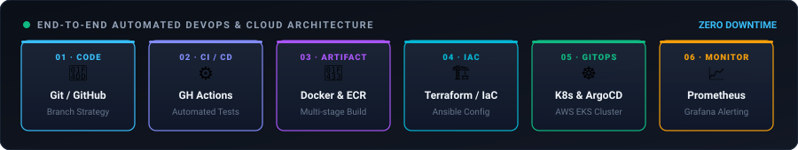

<!-- =================================================================== -->
<!--   SHUBHAM MANE // CLOUD & DEVOPS ENGINEERING COMMAND CENTER        -->
<!-- =================================================================== -->

<div align="center">
  
</div>

<!-- DYNAMIC TYPING SVG -->


<br>

<!-- CONNECT & VERIFIED CREDENTIALS BADGES -->
<div align="center">
  <a href="https://shubhu-io.github.io/Shubham-Mane/" target="_blank">
    
  </a>
  &nbsp;
  <a href="https://www.linkedin.com/in/shubham-mane-dev/" target="_blank">
    
  </a>
  &nbsp;
  <a href="mailto:shubhamane10@gmail.com">
    
  </a>
  &nbsp;
  <a href="https://github.com/shubhu-io" target="_blank">
    
  </a>
  &nbsp;
  <a href="https://www.credly.com/users/shubh-io" target="_blank">
    
  </a>
</div>

<br>

<!-- HEAVY COCKPIT STATUS HUD -->
<div align="center">
  
  &nbsp;
  
  &nbsp;
  
  &nbsp;
  
</div>

<br>

<!-- TARGET ROLES CLUSTER -->
<div align="center">
  
  &nbsp;
  
  &nbsp;
  
  &nbsp;
  
</div>

<br>

<!-- HEAVY CYBER TERMINAL COCKPIT -->
```bash
╔══════════════════════════════════════════════════════════════════════════════════════════════╗
║  SHUBHAM MANE // CLOUD & DEVOPS ENGINEERING COMMAND CENTER                                   ║
║  HOSTNAME: control-plane-01.infra.internal | KERNEL: Linux 6.8.0-x86_64 | REGION: ap-south-1 ║
╚══════════════════════════════════════════════════════════════════════════════════════════════╝
shubham@cloud-ops:~$ ./cluster-deploy.sh --target=production --profile=entry-level-devops
[✓] Authenticating Cloud Provider ............. [AWS IAM LEAST-PRIVILEGE VERIFIED]
[✓] Inspecting Terraform State Backend ........ [S3 BUCKET + DYNAMODB LOCKING - 0 DRIFT]
[✓] Validating Kubernetes Cluster ............. [NODES: 3/3 READY | HPA: ACTIVE | INGRESS: UP]
[✓] CI/CD Health Status ....................... [GITHUB ACTIONS + JENKINS - PASSING 100%]
[✓] Configuration Management .................. [ANSIBLE PLAYBOOKS - IDEMPOTENT RUNS OK]
[✓] Observability & Telemetry ................. [PROMETHEUS + GRAFANA METRICS ARMED]
[★] CANDIDATE OPERATIONAL STATUS .............. [READY FOR DEVOPS & CLOUD INFRASTRUCTURE ROLES 🚀]
```

<br>

<!-- HEAVY 6-METRIC TELEMETRY HUD -->
<table width="100%" border="0" cellpadding="10" cellspacing="0">
  <tr align="center">
    <td width="16%">
      <b>☁️ CLOUD</b><br>
      <sub>AWS Multi-AZ & VPC</sub>
    </td>
    <td width="16%">
      <b>🏗️ IAC</b><br>
      <sub>Terraform Modules</sub>
    </td>
    <td width="16%">
      <b>☸️ KUBERNETES</b><br>
      <sub>Deployments & HPA</sub>
    </td>
    <td width="16%">
      <b>🚀 CI / CD</b><br>
      <sub>Actions & Jenkins</sub>
    </td>
    <td width="16%">
      <b>⚙️ ANSIBLE</b><br>
      <sub>Idempotent Roles</sub>
    </td>
    <td width="16%">
      <b>🛡️ RESILIENCE</b><br>
      <sub>&lt; 5m RTO (S3 DR)</sub>
    </td>
  </tr>
</table>

<br>

---

<br>

<!-- ENGINEERING IDENTITY & AI MULTIPLIER -->
<table width="100%" border="0" cellpadding="12" cellspacing="0">
  <tr>
    <td width="55%" valign="top">
      <h2>👨‍💻 <span style="color:#38bdf8">Engineering Identity</span></h2>
      <p>
        <b>Computer Science & Engineering Graduate</b> bridging low-level operating system internals, Linux administration, and TCP/IP networking fundamentals with modern cloud automation and container orchestration.
      </p>
      <p>
        My engineering philosophy centers on <b>deterministic, self-healing, and immutable infrastructure</b>. Rather than relying on fragile manual steps or static tutorials, I believe in building infrastructure as code, deliberately injecting failure modes, analyzing runtime logs to identify root causes, and automating preventive fixes.
      </p>
      <p>
        
        &nbsp;
        &nbsp;
        &nbsp;
      </p>
    </td>
    <td width="5%"></td>
    <td width="40%" valign="top">
      <h2>🤖 <span style="color:#a855f7">AI-Augmented Engineering</span></h2>
      <p>
        I leverage AI as a force multiplier for rapid development speed, with <b>strict human-in-the-loop validation for production security and architecture</b>:
      </p>
      <ul>
        <li>⚡ <b>Rapid Scaffolding:</b> Accelerating Terraform boilerplate, Dockerfiles & Bash templates.</li>
        <li>🔍 <b>Log Triage & Regex:</b> Rapidly isolating needle-in-haystack errors across system logs.</li>
        <li>🧠 <b>Human Verification:</b> Manual audit of IAM least privilege, network topology, and state locking before apply.</li>
        <li>🛡️ <b>Production Safety:</b> Ensuring zero unreviewed code touches cloud resources.</li>
      </ul>
    </td>
  </tr>
</table>

<br>

<!-- HEAVY VALUE PROPOSITION TABLE -->
<div align="center">
  <h2>💡 &nbsp;<span style="color:#38bdf8">Engineering Value Proposition Matrix</span></h2>
  <p>How my hands-on approach translates directly into reliable production engineering.</p>
</div>

<table width="100%">
  <thead>
    <tr align="left">
      <th width="22%">Engineering Domain</th>
      <th width="38%">What Typical Candidates Do</th>
      <th width="40%">What I Build & Deliver</th>
    </tr>
  </thead>
  <tbody>
    <tr>
      <td><b>🏗️ Infrastructure Provisioning</b></td>
      <td>Manual clicks in the AWS Management Console; untracked configuration drift.</td>
      <td><b>100% Codified Terraform:</b> Modular HCL, remote S3 state with DynamoDB locking, and automated validation.</td>
    </tr>
    <tr>
      <td><b>🚀 Deployments & CI/CD</b></td>
      <td>Manual SSH file uploads, local Docker builds, and unversioned script runs.</td>
      <td><b>Automated CI/CD Pipelines:</b> Multi-stage GitHub Actions & Jenkins workflows with automated test gates and rollbacks.</td>
    </tr>
    <tr>
      <td><b>🐳 Container Workloads</b></td>
      <td>Single container <code>docker run</code> without health checks or persistence.</td>
      <td><b>Orchestrated Workloads:</b> Multi-container Docker Compose & K8s deployments with HPA, Ingress, and Liveness/Readiness probes.</td>
    </tr>
    <tr>
      <td><b>🔍 Troubleshooting & Triage</b></td>
      <td>"It works on my machine"; blindly restarting servers when errors occur.</td>
      <td><b>Structured SRE Methodology:</b> Root-cause analysis via <code>journalctl</code>, network tracing, and automated preventive runbooks.</td>
    </tr>
    <tr>
      <td><b>🛡️ Cloud Security</b></td>
      <td>Open <code>0.0.0.0/0</code> security groups and default administrative IAM credentials.</td>
      <td><b>Least Privilege Architecture:</b> Strict VPC subnet isolation, bastion jump boxes, non-root containers, and granular IAM policies.</td>
    </tr>
    <tr>
      <td><b>🤖 AI-Assisted Tooling</b></td>
      <td>Blindly copying AI outputs without understanding failure modes or security flaws.</td>
      <td><b>Strict Human-in-the-Loop:</b> Using AI for rapid syntax scaffolding while manually verifying security, network boundaries, and state.</td>
    </tr>
  </tbody>
</table>

<br>

---

<br>

<!-- END-TO-END PIPELINE ARCHITECTURE (SVG EMBED) -->
<div align="center">
  <h2>🔄 &nbsp;<span style="color:#38bdf8">End-to-End DevOps Architecture Lifecycle</span></h2>
  <p>How I structure continuous integration, infrastructure provisioning, and container deployment.</p>
</div>

<p align="center">
  
</p>

<br>

---

<br>

<!-- HEAVY MULTI-LAYER TECH STACK ARSENAL -->
<div align="center">
  <h2>⚙️ &nbsp;<span style="color:#38bdf8">Core Technical Arsenal & Stack</span></h2>
  <p>Production tools and technologies utilized across my projects, pipelines, and lab environments.</p>
</div>

<!-- AWS SERVICES BREAKDOWN -->
<div align="center">
  <p>
    <b>Amazon Web Services (AWS) Ecosystem</b><br>
    
    
    
    
    
    
    
    
    
    
  </p>
</div>

<table width="100%" border="0" cellpadding="10" cellspacing="0">
  <tr>
    <td width="50%" valign="top">
      <h4>☁️ Cloud & Virtualization</h4>
      <p></p>
      <sub>AWS (EC2, VPC, IAM, S3, RDS, EBS, EFS, Route 53, CloudWatch, ALB, ASG), Docker, K8s</sub>
    </td>
    <td width="50%" valign="top">
      <h4>🏗️ IaC, Config & CI/CD</h4>
      <p></p>
      <sub>Terraform Modules, Ansible Roles, Jenkins Declarative Pipelines, GitHub Actions CI/CD</sub>
    </td>
  </tr>
  <tr>
    <td width="50%" valign="top">
      <h4>💻 Systems, Scripting & Languages</h4>
      <p></p>
      <sub>Linux System Administration, Bash Automation, PowerShell Scripting, Python, Node.js</sub>
    </td>
    <td width="50%" valign="top">
      <h4>📊 Monitoring, Storage & Networking</h4>
      <p></p>
      <sub>Prometheus, Grafana, CloudWatch, MySQL, PostgreSQL, MongoDB, TCP/IP, DNS, Subnetting</sub>
    </td>
  </tr>
</table>

<br>

---

<br>

<!-- PRODUCTION PROJECTS SHOWCASE -->
<div align="center">
  <h2>🚀 &nbsp;<span style="color:#38bdf8">Production Deployments & Engineering Projects</span></h2>
  <p>Real-world repositories demonstrating high availability, disaster recovery, IaC, and container orchestration.</p>
</div>

<!-- CATEGORY 1: CLOUD & DISASTER RECOVERY -->
<h3>☁️ Sector 01: Enterprise Cloud & Disaster Recovery</h3>
<table width="100%">
  <tr>
    <td width="50%" valign="top">
      <sub><b style="color:#f59e0b">FLAGSHIP DEPLOYMENT · AWS & TERRAFORM</b></sub>
      <h3>Secure 3-Tier AWS Architecture</h3>
      <p><i>High-availability, fault-tolerant web application infrastructure</i></p>
      <p>
        Architected a production-ready <b>3-tier distributed system on AWS</b> with complete network isolation. Features public/private multi-AZ subnets, Internet & NAT Gateways, Application Load Balancer (ALB), EC2 Auto Scaling Groups running Docker containers, and a Multi-AZ RDS MySQL database.
      </p>
      <ul>
        <li><b>Automation:</b> 100% codified using modular Terraform with state locking.</li>
        <li><b>CI/CD:</b> Dual pipelines via GitHub Actions and Jenkins for build & test.</li>
        <li><b>Observability:</b> CloudWatch alarms for CPU, latency, and auto-scaling triggers.</li>
      </ul>
      <p>
        
        
        
        
        
      </p>
      <details>
        <summary><b>🔍 View Architecture Blueprint & Network Flow</b></summary>
        <br>
        <pre>
[User Traffic]
      │
      ▼ (HTTPS / Port 443)
[Internet Gateway] ──> [Application Load Balancer (Public Subnet AZ-A & AZ-B)]
                                    │
                                    ▼ (HTTP / Port 80)
┌───────────────────────────────────┴───────────────────────────────────┐
│ Private App Subnets (Auto Scaling Group of EC2 Instances)             │
│   ├── AZ-A: EC2 Instance [Docker App Container]                       │
│   └── AZ-B: EC2 Instance [Docker App Container]                       │
└───────────────────────────────────┬───────────────────────────────────┘
                                    │
                                    ▼ (MySQL / Port 3306)
┌───────────────────────────────────┴───────────────────────────────────┐
│ Private Database Subnets (Multi-AZ Amazon RDS MySQL)                  │
│   ├── AZ-A: Primary Database (Read/Write)                             │
│   └── AZ-B: Standby Replica (Synchronous Standby Failover)            │
└───────────────────────────────────────────────────────────────────────┘
        </pre>
      </details>
      <br>
      <a href="https://github.com/shubhu-io/secure-3-tier-aws-web-application" target="_blank">
        
      </a>
      &nbsp;
      <a href="https://shubhu-io.github.io/secure-3-tier-aws-web-application/" target="_blank">
        
      </a>
    </td>
    <td width="50%" valign="top">
      <sub><b style="color:#38bdf8">ENTERPRISE AUTOMATION · DISASTER RECOVERY</b></sub>
      <h3>CloudVault DR Automation</h3>
      <p><i>Automated backup pipeline & fast-recovery system to AWS S3</i></p>
      <p>
        Engineered an automated disaster recovery pipeline protecting critical enterprise file systems and application states by syncing encrypted archives to Amazon S3.
      </p>
      <ul>
        <li><b>RTO / RPO:</b> Achieved <b>&lt; 5 min RTO</b> and <b>99.9% backup reliability</b>.</li>
        <li><b>Storage Optimization:</b> S3 lifecycle rules transitioning data to Glacier.</li>
        <li><b>Resilience:</b> Automated MD5 hash integrity verification and failover alerting.</li>
      </ul>
      <p>
        
        
        
        
      </p>
      <details>
        <summary><b>🔍 View Disaster Recovery SLA & Metric Matrix</b></summary>
        <br>
        <table>
          <tr><th>Metric</th><th>Target</th><th>Achieved</th></tr>
          <tr><td>Recovery Time (RTO)</td><td>&lt; 15 mins</td><td><b>&lt; 5 mins</b></td></tr>
          <tr><td>Recovery Point (RPO)</td><td>1 hour</td><td><b>15 mins</b></td></tr>
          <tr><td>Backup Integrity</td><td>99.0%</td><td><b>99.9% (MD5 Verified)</b></td></tr>
          <tr><td>Tiering Policy</td><td>Standard</td><td><b>Standard ➔ Glacier (90d)</b></td></tr>
        </table>
      </details>
      <br>
      <a href="https://github.com/shubhu-io/CloudVault-DR-Automation" target="_blank">
        
      </a>
    </td>
  </tr>
</table>

<br>

<!-- CATEGORY 2: CONTAINERS & KUBERNETES -->
<h3>☸️ Sector 02: Containerization, Kubernetes & Orchestration</h3>
<table width="100%">
  <tr>
    <td width="50%" valign="top">
      <sub><b style="color:#38bdf8">KUBERNETES WORKLOAD MANAGEMENT</b></sub>
      <h3>K8s Application Deployment</h3>
      <p><i>Production Kubernetes manifests with self-healing & auto-scaling</i></p>
      <p>
        Configured a resilient Kubernetes deployment for microservices implementing cloud-native operational best practices.
      </p>
      <ul>
        <li><b>Zero Downtime:</b> RollingUpdate strategy with Liveness & Readiness probes.</li>
        <li><b>Auto-scaling:</b> Horizontal Pod Autoscaler (HPA) responding to CPU/memory limits.</li>
        <li><b>Traffic & Security:</b> Ingress controller routing and non-root <code>securityContext</code>.</li>
      </ul>
      <p>
        
        
        
        
      </p>
      <details>
        <summary><b>🔍 View Manifest Highlights & Specs</b></summary>
        <br>
        <pre>
strategy:
  type: RollingUpdate
  rollingUpdate:
    maxSurge: 25%
    maxUnavailable: 0
livenessProbe:
  httpGet:
    path: /healthz
    port: 8080
  initialDelaySeconds: 15
  periodSeconds: 10
securityContext:
  runAsNonRoot: true
  readOnlyRootFilesystem: true
        </pre>
      </details>
      <br>
      <a href="https://github.com/shubhu-io/kubernetes-application-deployment" target="_blank">
        
      </a>
    </td>
    <td width="50%" valign="top">
      <sub><b style="color:#a855f7">DOCKER & MULTI-CONTAINER COMPOSITION</b></sub>
      <h3>Dockerized Web Application</h3>
      <p><i>Multi-tier container architecture orchestrated via Docker Compose</i></p>
      <p>
        Containerized a full-stack web application featuring an Nginx reverse proxy, Node.js backend runtime, and PostgreSQL database.
      </p>
      <ul>
        <li><b>Isolation:</b> Custom Docker bridge networks segregating internal database traffic.</li>
        <li><b>Persistence:</b> Named volume management ensuring database durability.</li>
        <li><b>Image Optimization:</b> Multi-stage builds reducing attack surface and image size.</li>
      </ul>
      <p>
        
        
        
        
      </p>
      <details>
        <summary><b>🔍 View Multi-Container Topology</b></summary>
        <br>
        <pre>
[Host Port 80/443]
       │
       ▼
 [Nginx Reverse Proxy Container] (frontend-net)
       │
       ▼ (Internal HTTP)
 [Node.js Application Container] (frontend-net + backend-net)
       │
       ▼ (Port 5432 / Isolated)
 [PostgreSQL Database Container] (backend-net + Named Volume)
        </pre>
      </details>
      <br>
      <a href="https://github.com/shubhu-io/dockerized-web-application" target="_blank">
        
      </a>
    </td>
  </tr>
</table>

<br>

<!-- CATEGORY 3: CI/CD & AUTOMATION -->
<h3>🚀 Sector 03: CI/CD Pipelines & Configuration Management</h3>
<table width="100%">
  <tr>
    <td width="50%" valign="top">
      <sub><b style="color:#10b981">ENTERPRISE PIPELINE AUTOMATION</b></sub>
      <h3>Jenkins CI/CD Declarative Pipeline</h3>
      <p><i>Automated build, test, scan, and containerized deployment</i></p>
      <p>
        Engineered a multi-stage Jenkinsfile pipeline enforcing code quality gates, Docker Buildx image creation, automated testing, and health-checked staging deployment with rollback triggers.
      </p>
      <p>
        
        
        
        
      </p>
      <details>
        <summary><b>🔍 View Pipeline Execution Flow</b></summary>
        <br>
        <p><code>Checkout</code> ➔ <code>Lint & Unit Test</code> ➔ <code>Docker Buildx Cache</code> ➔ <code>Security Scan</code> ➔ <code>Staging Deploy</code> ➔ <code>Health Probe (Rollback on Failure)</code></p>
      </details>
      <br>
      <a href="https://github.com/shubhu-io/jenkins-cicd-pipeline" target="_blank">
        
      </a>
    </td>
    <td width="50%" valign="top">
      <sub><b style="color:#ef4444">IDEMPOTENT SERVER ORCHESTRATION</b></sub>
      <h3>Ansible Server Configuration</h3>
      <p><i>Modular Ansible roles to provision & harden Linux servers</i></p>
      <p>
        Developed modular and idempotent Ansible playbooks and roles (<code>common</code>, <code>nginx</code>, <code>app</code>) to automate package provisioning, user management, firewall hardening, and Nginx proxy setups on Ubuntu.
      </p>
      <p>
        
        
        
        
      </p>
      <details>
        <summary><b>🔍 View Modular Roles Breakdown</b></summary>
        <br>
        <ul>
          <li><code>roles/common</code>: UFW firewall, SSH hardening, NTP, essential packages.</li>
          <li><code>roles/nginx</code>: Reverse proxy templating with Jinja2, SSL setup.</li>
          <li><code>roles/app</code>: Systemd service management, user sandbox.</li>
        </ul>
      </details>
      <br>
      <a href="https://github.com/shubhu-io/ansible-server-configuration" target="_blank">
        
      </a>
    </td>
  </tr>
  <tr>
    <td width="50%" valign="top">
      <sub><b style="color:#38bdf8">CLOUD INFRASTRUCTURE & TOPOLOGY</b></sub>
      <h3>Modular AWS VPC via Terraform</h3>
      <p><i>Production VPC topology with subnets, NAT, and Bastion host</i></p>
      <p>
        Reusable Terraform infrastructure provisioning a full AWS VPC with public/private subnet pairs across availability zones, Internet Gateway, route tables, and a secure Bastion jump box.
      </p>
      <p>
        
        
        
      </p>
      <a href="https://github.com/shubhu-io/git-terraform-vpc" target="_blank">
        
      </a>
    </td>
    <td width="50%" valign="top">
      <sub><b style="color:#a855f7">SECURE GITHUB ACTIONS PIPELINE</b></sub>
      <h3>GitHub Actions CI/CD with GHCR & OIDC</h3>
      <p><i>Modern automated image publishing with OpenID Connect</i></p>
      <p>
        Engineered a secure CI/CD workflow publishing multi-platform container images to GitHub Container Registry (GHCR) using keyless OIDC authentication and caching strategies.
      </p>
      <p>
        
        
        
      </p>
      <a href="https://github.com/shubhu-io/github-actions-cicd" target="_blank">
        
      </a>
    </td>
  </tr>
</table>

<br>

<!-- CATEGORY 4: DEVOPS LABS & LEARNING STUDIO -->
<h3>📚 Sector 04: DevOps Mastery Labs & Technical Studies</h3>
<table width="100%">
  <tr>
    <td width="33%" valign="top">
      <sub><b style="color:#f59e0b">8-IN-1 PORTFOLIO</b></sub>
      <h4>🛠️ DevOps Showcase</h4>
      <p>8 production-inspired standalone projects spanning Linux, Nginx, Docker, Jenkins, AWS, Terraform, K8s & Ansible.</p>
      <a href="https://github.com/shubhu-io/devops-showcase" target="_blank">
        
      </a>
    </td>
    <td width="33%" valign="top">
      <sub><b style="color:#a855f7">CONTINUOUS LEARNING</b></sub>
      <h4>🔄 Daily DevOps 365</h4>
      <p>My continuous 365-day technical growth studio documenting troubleshooting logs, daily labs, and curriculum notes.</p>
      <a href="https://github.com/shubhu-io/daily-devops-365" target="_blank">
        
      </a>
    </td>
    <td width="33%" valign="top">
      <sub><b style="color:#10b981">VERSION CONTROL MASTERY</b></sub>
      <h4>🌿 Git & GitHub Practice</h4>
      <p>110+ comprehensive practical files mastering branching models, interactive rebasing, merge conflicts, and hooks.</p>
      <a href="https://github.com/shubhu-io/git-github-practice" target="_blank">
        
      </a>
    </td>
  </tr>
</table>

<br>

---

<br>

<!-- TECHNICAL COMPETENCY MATRIX (ATS OPTIMIZED) -->
<div align="center">
  <h2>🎯 &nbsp;<span style="color:#38bdf8">DevOps & Cloud Core Competencies Matrix</span></h2>
  <p>Practical operational capabilities across enterprise cloud, systems, and automation domains.</p>
</div>

<table width="100%">
  <thead>
    <tr align="left">
      <th width="28%">Domain</th>
      <th width="72%">Hands-On Competencies & Technologies</th>
    </tr>
  </thead>
  <tbody>
    <tr>
      <td><b>☁️ Amazon Web Services (AWS)</b></td>
      <td>EC2, VPC, Public/Private Subnets, NAT Gateways, Internet Gateways, Security Groups, NACLs, IAM (Users, Roles, Policies, Least Privilege), S3 (Lifecycle, Versioning, Replication), RDS MySQL Multi-AZ, ALB (Application Load Balancer), Auto Scaling Groups (ASG), Route 53, CloudWatch Logs & Alarms.</td>
    </tr>
    <tr>
      <td><b>🏗️ Infrastructure as Code (IaC)</b></td>
      <td>Terraform (HCL, Modular architectures, State file isolation, S3 backend with DynamoDB locking, plan/apply lifecycles, variable interpolation, output schemas).</td>
    </tr>
    <tr>
      <td><b>🐳 Containerization & K8s</b></td>
      <td>Docker (Multi-stage builds, non-root users, layer caching, image shrinking), Docker Compose (Multi-container orchestration, persistent volumes, bridge networks), Kubernetes (Pods, Deployments, ClusterIP/NodePort Services, Ingress, HPA, Liveness/Readiness Probes).</td>
    </tr>
    <tr>
      <td><b>🔄 CI/CD & Automation</b></td>
      <td>GitHub Actions (Workflows, secrets management, multi-platform builds, OIDC, GHCR publishing), Jenkins (Declarative pipelines, Jenkinsfile syntax, Docker build & test stages, automated rollback execution).</td>
    </tr>
    <tr>
      <td><b>⚙️ Configuration Management</b></td>
      <td>Ansible (Playbooks, reusable roles, idempotent execution, variable management, Jinja2 templating, Ubuntu/Nginx automation).</td>
    </tr>
    <tr>
      <td><b>🐧 Systems, Scripting & Networking</b></td>
      <td>Linux administration (Ubuntu, Debian, CentOS), Bash scripting (error handling, loops, system automation), PowerShell, TCP/IP, DNS records, CIDR subnetting, SSH bastion configurations, systemd service management.</td>
    </tr>
    <tr>
      <td><b>📊 Observability & Monitoring</b></td>
      <td>Prometheus (Metrics scraping, node_exporter), Grafana (Dashboard creation, alerts), AWS CloudWatch (Metrics, Log Groups, Alarm thresholds).</td>
    </tr>
  </tbody>
</table>

<br>

---

<br>

<!-- SRE / TROUBLESHOOTING PROTOCOL -->
<div align="center">
  <h2>🛡️ &nbsp;<span style="color:#38bdf8">Operational Troubleshooting & Incident Playbook</span></h2>
  <p>My systematic method for detecting, triaging, and resolving system outages and regressions.</p>
</div>

<table width="100%">
  <tr align="center">
    <td width="25%" valign="top">
      <h4>🚨 1. Detect</h4>
      <p align="left">
        <sub>• CloudWatch & Prometheus alert thresholds<br>
        • 5xx/4xx HTTP error spikes on ALB<br>
        • Health check probe failures</sub>
      </p>
    </td>
    <td width="25%" valign="top">
      <h4>🔍 2. Isolate</h4>
      <p align="left">
        <sub>• SSH bastion / EC2 access<br>
        • Inspect <code>journalctl</code> & <code>/var/log</code><br>
        • Query <code>docker logs</code> / <code>kubectl logs -p</code></sub>
      </p>
    </td>
    <td width="25%" valign="top">
      <h4>⚡ 3. Remediate</h4>
      <p align="left">
        <sub>• Diagnose disk (<code>df -h</code>), RAM (<code>free -m</code>)<br>
        • Test network routes (<code>curl -Iv</code>, <code>netstat</code>)<br>
        • Roll back bad deployment or scale ASG</sub>
      </p>
    </td>
    <td width="25%" valign="top">
      <h4>📝 4. Automate</h4>
      <p align="left">
        <sub>• Codify fix in Terraform / Ansible<br>
        • Add automated regression test to CI<br>
        • Document RCA in repository runbook</sub>
      </p>
    </td>
  </tr>
</table>

<details>
  <summary><b>🛠️ Click to View Rapid Incident Triage Commands Cheat Sheet</b></summary>
  <br>
  <pre>
# Linux & System Diagnostics
journalctl -u nginx --since "15 min ago" -f           # Live Nginx service logs
ss -tulpn | grep -E ':(80|443|3000|5432|3306)'        # Check active listening ports
vmstat 1 5                                            # System bottleneck analysis (CPU/IO)
df -h && free -m                                      # Disk space and RAM consumption triage

# Docker & Container Isolation
docker ps -a --filter "status=exited"                 # Identify crashing containers
docker logs --tail 100 -f &lt;container_id&gt;               # Stream container error outputs
docker inspect --format='{{range .NetworkSettings.Networks}}{{.IPAddress}}{{end}}' &lt;id&gt;

# Kubernetes Pod & Service Triage
kubectl get pods -A --field-selector=status.phase!=Running  # Query non-running pods
kubectl describe pod &lt;pod_name&gt; | grep -A 10 Events:        # Review pod termination events
kubectl logs &lt;pod_name&gt; --previous                          # CrashLoopBackOff triage
  </pre>
</details>

<br>

---

<br>

<!-- ROADMAP & PROGRESS BARS -->
<div align="center">
  <h2>🗺️ &nbsp;<span style="color:#38bdf8">DevOps Competency Progression</span></h2>
  <p>Tracked progression of hands-on production skills and active certifications roadmap.</p>
</div>

<table width="100%">
  <tr>
    <td width="50%" valign="top">
      <b>🐧 Linux Administration & Shell Automation</b>
      <br><code>[████████████████████] 100%</code> (Systemd, Users, Networking, Bash)
      <br><br>
      <b>☁️ AWS Core Cloud Infrastructure</b>
      <br><code>[████████████████████] 100%</code> (VPC, EC2, IAM, S3, RDS, ALB, ASG)
      <br><br>
      <b>🏗️ Infrastructure as Code (Terraform)</b>
      <br><code>[████████████████████] 100%</code> (Modular IaC, S3 State Locking)
      <br><br>
      <b>🐳 Containerization (Docker & Compose)</b>
      <br><code>[████████████████████] 100%</code> (Multi-stage builds, Bridge networks)
    </td>
    <td width="50%" valign="top">
      <b>🚀 CI/CD Automation (GitHub Actions & Jenkins)</b>
      <br><code>[████████████████░░░░] 80%</code> (Declarative pipelines, OIDC, GHCR)
      <br><br>
      <b>☸️ Kubernetes Workload Management (CKA Path)</b>
      <br><code>[██████████████░░░░░░] 70%</code> (Deployments, Ingress, HPA, Probes)
      <br><br>
      <b>📊 Observability (Prometheus & Grafana)</b>
      <br><code>[████████████░░░░░░░░] 60%</code> (Node Exporters, Metrics, Alarms)
      <br><br>
      <b>🔄 GitOps & Continuous Delivery (ArgoCD)</b>
      <br><code>[████████░░░░░░░░░░░░] 40%</code> (Actively Exploring & Lab Building)
    </td>
  </tr>
</table>

<br>

---

<br>

<!-- EDUCATION, CERTIFICATIONS & ROADMAP -->
<table width="100%">
  <tr>
    <td width="50%" valign="top">
      <h2>🎓 <span style="color:#38bdf8">Education & Credentials</span></h2>
      <ul>
        <li>
          <b>Bachelor of Technology (B.Tech) in Computer Science & Engineering</b><br>
          <sub>Strong theoretical & practical grounding in Operating Systems, Database Systems, Computer Networks, and Software Engineering.</sub>
        </li>
        <br>
        <li>
          <b>Verified Technical Credentials</b><br>
          <sub>Access verified digital skill badges on Credly:</sub><br>
          <a href="https://www.credly.com/users/shubh-io" target="_blank">
            
          </a>
        </li>
      </ul>
    </td>
    <td width="50%" valign="top">
      <h2>🌱 <span style="color:#a855f7">Current Roadmap & Upskilling</span></h2>
      <ul>
        <li>☸️ <b>Certified Kubernetes Administrator (CKA):</b> Advanced cluster architecture, etcd backups, and network policies.</li>
        <li>🔄 <b>GitOps with ArgoCD:</b> Declarative, pull-based Kubernetes continuous delivery.</li>
        <li>🛡️ <b>DevSecOps:</b> Integrating Trivy container scanning and SonarQube in CI pipelines.</li>
        <li>☁️ <b>AWS Solutions Architect:</b> Deep dive into Well-Architected Framework pillars.</li>
      </ul>
    </td>
  </tr>
</table>

<br>

<!-- ENGINEERING PHILOSOPHY -->
<div align="center">
  <h2>🧠 &nbsp;<span style="color:#38bdf8">Engineering Operating Principles</span></h2>
  <blockquote>
    <b>Learn ➔ Build ➔ Deliberately Break ➔ Debug ➔ Document ➔ Automate ➔ Improve</b>
  </blockquote>
  <p>
    <i>"If you have to do it manually more than twice, write a script. If it holds state or infrastructure, codify it in Terraform. If it runs an application, isolate it in a container. If it breaks, learn the root cause and automate the prevention."</i>
  </p>
</div>

<br>

---

<br>

<!-- TELEMETRY & GITHUB ACTIVITY -->
<div align="center">
  <h2>📊 &nbsp;<span style="color:#38bdf8">GitHub Telemetry & Activity Metrics</span></h2>
</div>

<div align="center">
  <table border="0" cellspacing="0" cellpadding="0" width="100%">
    <tr align="center">
      <td width="50%" valign="top">
        <a href="https://github.com/shubhu-io">
          
        </a>
      </td>
      <td width="50%" valign="top">
        <a href="https://github.com/shubhu-io">
          
        </a>
      </td>
    </tr>
  </table>
</div>

<br>

<div align="center">
  <a href="https://github.com/shubhu-io">
    
  </a>
</div>

<br>

<div align="center">
  <picture>
    <source media="(prefers-color-scheme: dark)" srcset="https://raw.githubusercontent.com/shubhu-io/shubhu-io/output/github-snake-dark.svg">
    <source media="(prefers-color-scheme: light)" srcset="https://raw.githubusercontent.com/shubhu-io/shubhu-io/output/github-snake.svg">
    
  </picture>
</div>

<br><br>

---

<br>

<!-- CAREER GOAL & CONNECT -->
<table width="100%">
  <tr>
    <td width="60%" valign="top">
      <h2>🎯 <span style="color:#38bdf8">Career Goal & Vision</span></h2>
      <p>
        My goal is to join a forward-thinking engineering team as an <b>Entry-Level DevOps Engineer, Cloud Engineer, or Infrastructure Associate</b>, where I can apply my hands-on AWS, Terraform, Docker, and CI/CD foundations to build reliable, scalable cloud platforms.
      </p>
      <p>
        I bring a blend of strong computer science fundamentals, continuous curiosity, an automation-first mindset, and practical experience architecting real-world deployments.
      </p>
    </td>
    <td width="5%"></td>
    <td width="35%" valign="top">
      <h2>📬 <span style="color:#a855f7">Let's Connect</span></h2>
      <p>Looking for a motivated cloud practitioner who loves infrastructure?</p>
      <p>
        <a href="https://www.linkedin.com/in/shubham-mane-dev/" target="_blank">
          
        </a>
      </p>
      <p>
        <a href="mailto:shubhamane10@gmail.com">
          
        </a>
      </p>
      <p>
        <a href="https://shubhu-io.github.io/Shubham-Mane/" target="_blank">
          
        </a>
      </p>
    </td>
  </tr>
</table>

<br>

<div align="center">
  <sub>Designed &amp; Maintained by <b>Shubham Mane</b> • Built for continuous infrastructure learning</sub>
</div>
